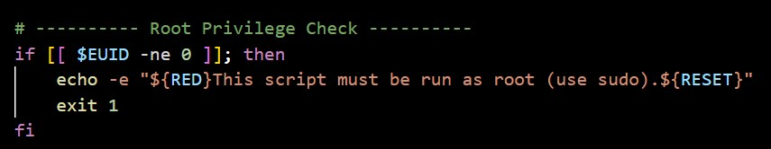
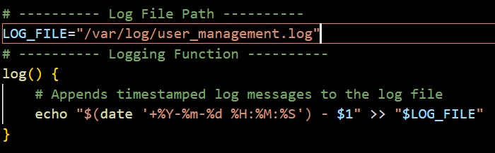
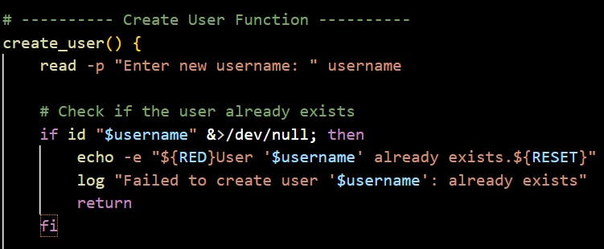
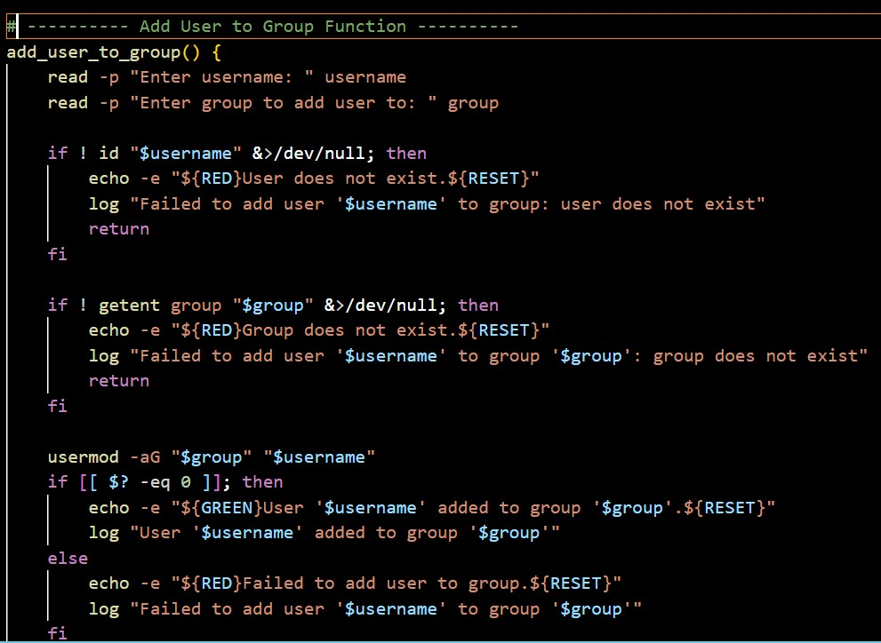
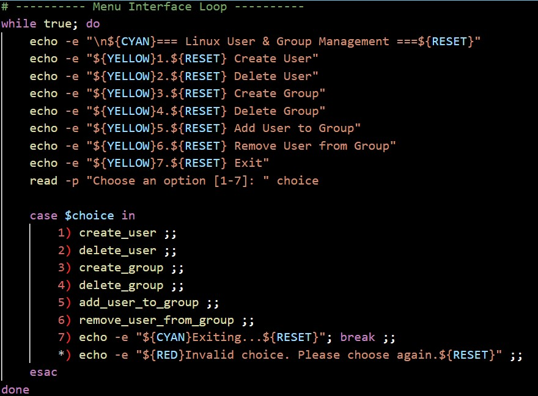
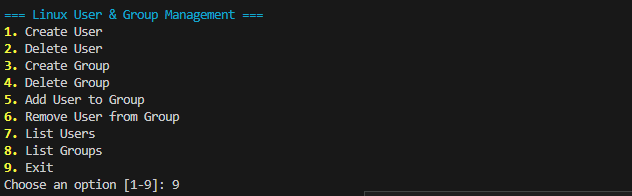

# Bash Scripting DevOps

<strong>TASK</strong>: Linux User and Group Management Script with Logging.

<strong>DIFFICULTY</strong>: Easy

<strong>Skills practiced</strong>: User and group management commands (useradd, usermod, userdel, groupadd, groupdel, passwd), shell scripting, sudoers file, logging, error handling.

<strong>Project Description</strong>: Create a comprehensive Bash script that automates the process of adding, modifying, and deleting users and groups on a Linux system. The script should include robust error handling and log all actions for auditing purposes.

<strong>Steps to consider:</strong>

  <ul>
      <li>Design a menu-driven script that presents options for user/group management.</li>
      <li>Implement functions for:</li>
      <Li>Creating new users (with home directories, shells, and initial passwords).</li>
      <li>Deleting users.</li>
      <li>Adding users to existing groups.</li>
      <li>Removing users from groups.</li>
      <li>Creating new groups.</li>
      <li>Deleting groups.</li>
      <li>List Users</li>
      <li>List Groups</li>
      <li>Exit Function</li>
     <li>Ensure the script prompts for necessary information (username, group name, etc.).</li>
      <li>Implement input validation to prevent common errors.</li>
      <li>Log all successful and failed operations to a dedicated log file (e.g., /var/log/user_management.log).</li>
      <li>Consider how to handle sudo privileges for the script's execution.</li>
      <li>Add clear messages to the user about the success or failure of each operation.</li>
  </ul>

#  SOLUTION

 <strong>The</strong> first thing i did was to first create my file. This file has to be a bash file that will end with <em>.sh</em>. The name of this file is <strong>users.sh</strong>

 <strong>STEP 1:</strong>
User and group management needs administrative access so the first script that i wrote checked that. 

<strong>STEP 2:</strong>
I created a log file to keep track and save what happens throughout each process.

<strong>STEP 3:</strong>
I wrote out the function to create a new user 

<strong>STEP 4:</strong>
I repeated the same pattern for other actions.

<strong>STEP 5:</strong>
I built a menu for easier user access.

<strong>END RESULT</strong>

The end result is shown below using the command <strong>sudo ./users.sh</strong>

<strong>
Hassan Adelakin
</strong>

